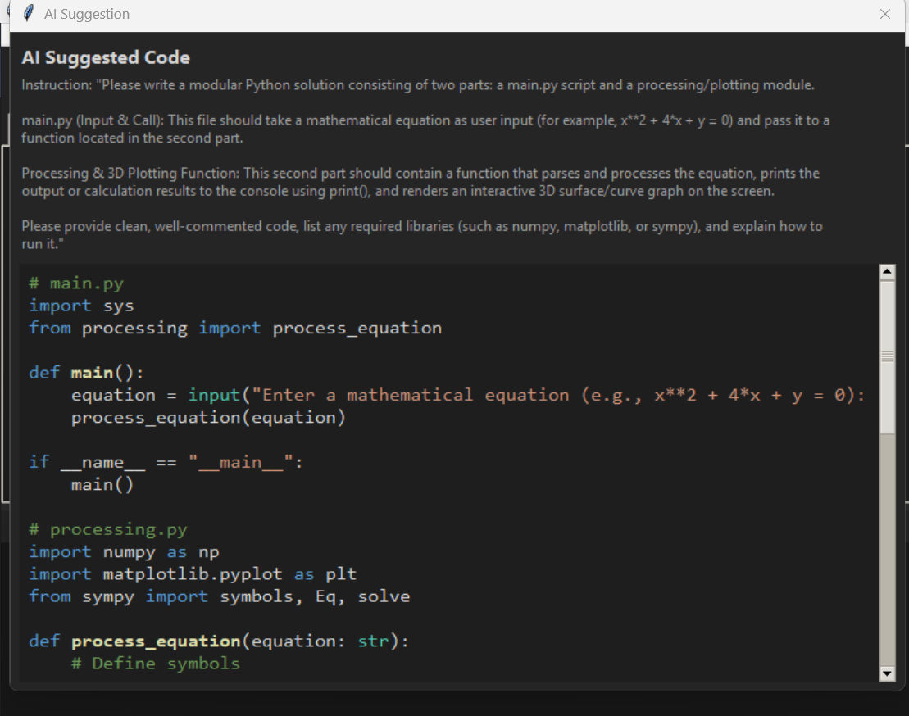
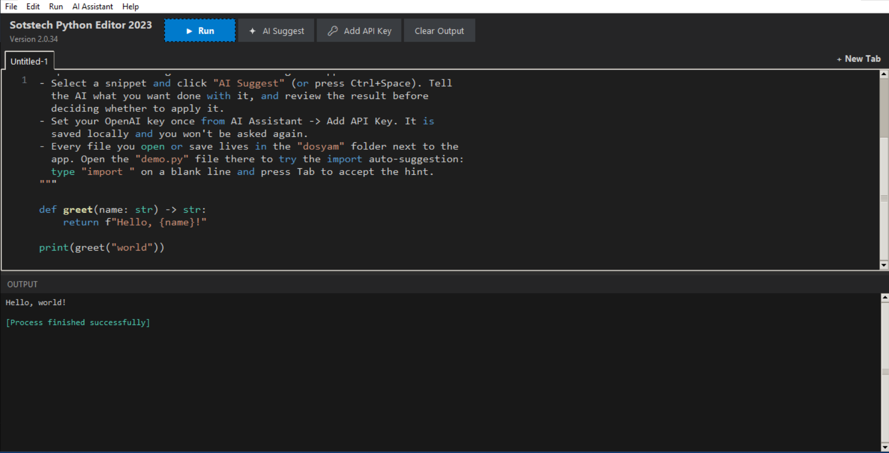
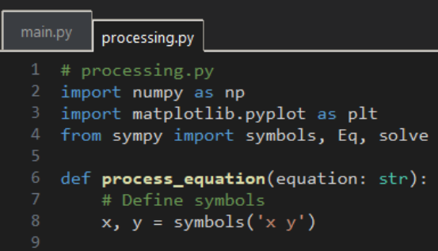
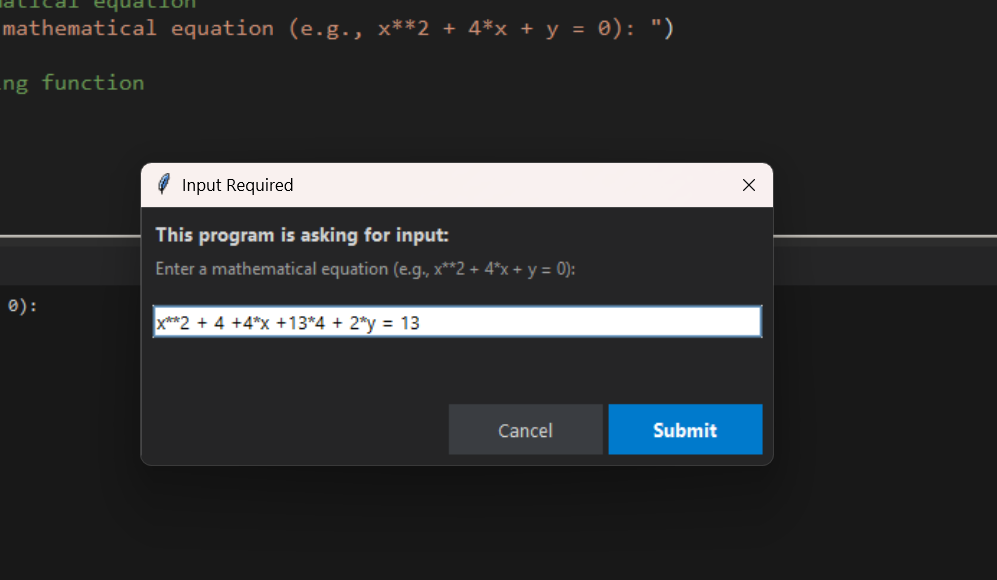
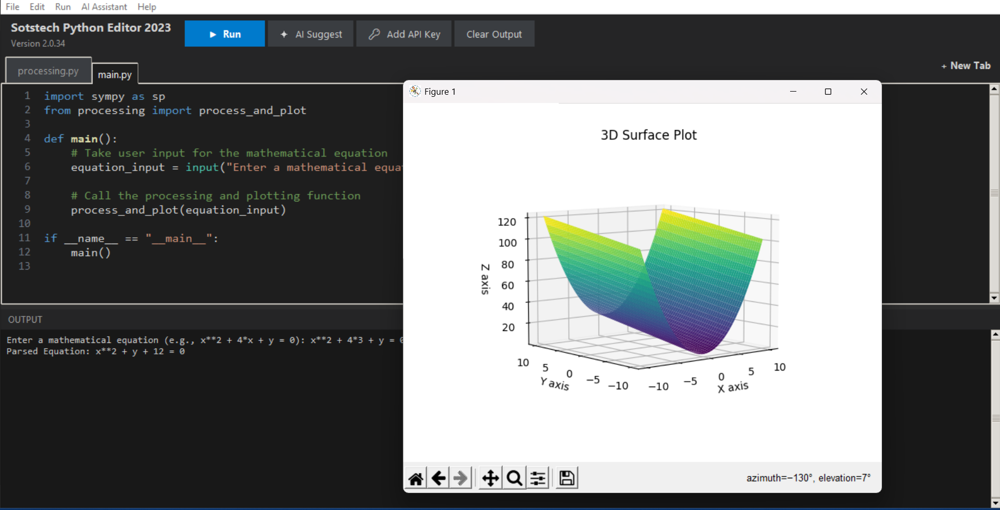
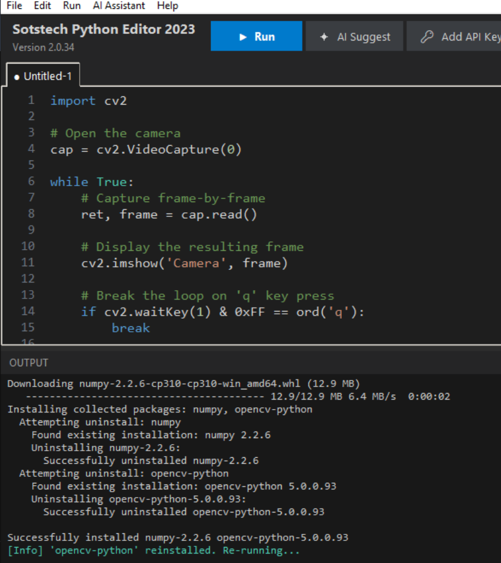
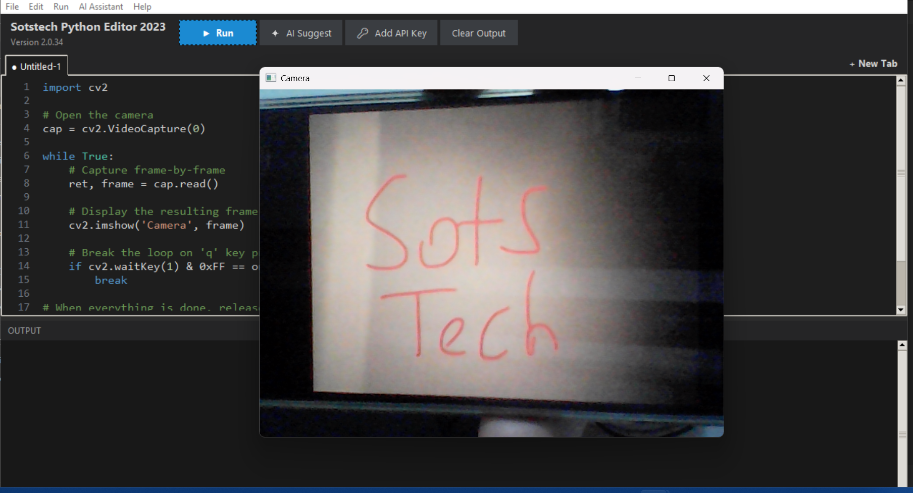

<div align="center">

# 🧠 Sotstech Python Editor

### An AI-powered, multi-tab, desktop Python code editor


**Write code, run it instantly, select any snippet, describe what you want in plain English — and let AI rewrite it for you.**
Missing libraries get installed automatically, `input()` calls are handled through a clean modern dialog instead of freezing your console, and graphical output from matplotlib, OpenCV, and more just works.

[Features](#-features) •
[Screenshots](#-screenshots) •
[Installation](#-installation) •
[API Key Setup](#-setting-up-your-openai-api-key) •
[Using the .exe](#-using-the-prebuilt-exe-windows) •
[Tech Stack](#️-tech-stack) •
[Project Structure](#-project-structure)

</div>

---

## 📌 About

**Sotstech Python Editor** is a polished, dark-themed desktop Python IDE built entirely on Tkinter. It delivers everything you'd expect from a serious code editor — multi-tab editing, syntax highlighting, line numbers, a live output console — and then goes further by wiring in a genuinely useful **AI coding assistant**: select any block of code, tell it in plain English what you want done ("optimize this," "add error handling," "split this into two modules"), and the AI rewrites it for you. Nothing touches your editor until you explicitly approve the change.

What really sets this editor apart is how *seamlessly* it runs real-world code. It doesn't just execute scripts — it actively supports them: it detects and silently installs missing dependencies, keeps matplotlib and OpenCV windows working flawlessly, and — most notably — replaces Python's blocking `input()` with a genuinely modern, non-blocking input experience (more on that below ⭐).

The project ships both as readable source code **and** as a single-file, dependency-free Windows `.exe`, built with PyInstaller straight from this repo.

---

## 🖼 Screenshots

The flow below is taken directly from real usage: solving a math equation and plotting it in 3D, then spinning up a live webcam app — all from a single plain-English instruction, without writing a line of code by hand.

<table>
<tr>
<td width="50%">

**1️⃣ Home screen & built-in demo**
Dark IDE theme, tab strip, toolbar (Run / AI Suggest / Add API Key), and a live console panel at the bottom. On first launch, a ready-to-run example file (`demo.py`) walks you through the basics — one click and it's running.


</td>
<td width="50%">

**2️⃣ AI Suggest — instruct it in plain English**
Hit `Ctrl+Space` or click **AI Suggest** and simply describe what you want. Example instruction shown here: *"Write a modular Python solution with a main.py and a processing/plotting module that takes an equation from the user and renders a 3D graph."*



</td>
</tr>
<tr>
<td width="50%">

**3️⃣ AI-generated code — reviewed before it touches anything**
The model turns your instruction into a complete, working two-file solution (`main.py` + `processing.py`). Nothing is applied blindly — the full result is shown first, and you choose **"Yes, Replace Code"** or reject it entirely.



</td>
<td width="50%">

**4️⃣ Generated code, fully syntax-highlighted**
Once approved, the code lands directly in the right tab (`processing.py` here) — `numpy`, `matplotlib`, and `sympy` imports and function definitions rendered with live syntax highlighting, exactly as if you'd typed it yourself.



</td>
</tr>
<tr>
<td width="50%">

### ⭐ 5️⃣ Modern, non-blocking `input()` handling
This is one of the editor's standout features. When your running code calls `input()`, most simple runners either freeze or crash — here, a clean, modern **"Input Required"** dialog pops up instead, complete with the original prompt text. You type your value, hit submit, and execution continues exactly where it left off. It feels less like a script running in a sandbox and more like a real, interactive application.



</td>
<td width="50%">

**6️⃣ Instant execution + graphical output**
Press `Run` (`F5`) and the console immediately prints the parsed equation via `sympy`, while `matplotlib` opens a fully interactive, rotatable **3D surface plot** in its own window — no extra configuration required.



</td>
</tr>
<tr>
<td width="50%">

**7️⃣ Automatic dependency installation**
In a completely different example (a live webcam app using `cv2`), the editor detects that `numpy` and `opencv-python` are missing or version-mismatched, **installs them automatically via pip in the background**, and re-runs the code — the user never has to open a terminal.



</td>
<td width="50%">

**8️⃣ Real-time hardware access**
Right after auto-installation, an OpenCV window opens showing a live feed straight from the computer's webcam. The editor handles any window-spawning Python code gracefully — matplotlib, OpenCV, Tkinter, and beyond.



</td>
</tr>
</table>

---

## ✨ Features

### 📝 Editor
- **Multi-tab editing** — open unlimited pages with `+ New Tab` (`Ctrl+T`); `Run` and `AI Suggest` always act on whichever tab is currently active.
- **Syntax highlighting** — a lightweight, dependency-free Python highlighter (keywords, strings, comments, numbers, built-ins).
- **Synced line-number gutter** in every tab.
- **Polished dark theme** — a professional color palette across the toolbar, tab strip, and status bar.
- **Standard file operations** — Open, Save, Save As, with per-tab unsaved-changes protection.
- **`dosyam/` workspace folder** — every file you open or save lives right next to the app itself.
- **Smart import auto-suggestion** — start typing `import ` or `from ` and any other `.py` file in the workspace is suggested inline in faded gray; press `Tab` to accept.
- **Crash-proof by design** — any unexpected error (in your code, an AI request, or the editor itself) is caught, surfaced to you, and logged to the Output panel. The app never silently dies on you.

### 🤖 AI Assistant
- **Instruction-driven code suggestions** — select any snippet, hit `AI Suggest` (`Ctrl+Space`), and describe exactly what you want in free-form English.
- **Safe by default, review-first workflow** — generated code is never applied automatically; you see it side-by-side and explicitly choose **Replace** or **Keep Original**.
- **Set your API key once, forget about it** — enter it once via `Add API Key`, and it's remembered locally forever.
- Powered by OpenAI's Chat Completions API using **`gpt-4o-mini`** (fully configurable via an environment variable).

### ▶️ Code Execution Engine
- **One-click Run** (`F5`) — execute the active tab and see output/errors in the shared console.
- **⭐ Modern `input()` handling** — the editor's signature feature: a clean input dialog captures values from running scripts instead of blocking or crashing the console, making interactive scripts feel like real applications.
- **Automatic missing-package detection & installation** — `ModuleNotFoundError`s and ABI mismatches are detected, the right pip package is identified, installed automatically, and the code is re-run — completely hands-free.
- **Robust matplotlib GUI backend handling** — plots reliably open in their own interactive Tk-backed window every time.
- **Full support for GUI-spawning code** — matplotlib figures, OpenCV camera windows, Tkinter windows, and more, all work out of the box.

### 📦 Distribution
- **Single-file `.exe` via PyInstaller** — `build_exe.bat` sets up an isolated virtual environment, installs dependencies into it, and builds a `--onefile --windowed` executable. No installer, no setup wizard.
- The `dosyam/` workspace is created **permanently next to the actual `.exe`** (not PyInstaller's temp folder), so nothing you save ever disappears between runs.

---

## ⌨️ Keyboard Shortcuts

| Action              | Shortcut           |
|---------------------|---------------------|
| Run code            | `F5`                |
| AI Suggest          | `Ctrl + Space`      |
| New tab             | `Ctrl + T`          |
| Close tab           | `Ctrl + W`          |
| Open file           | `Ctrl + O`          |
| Save                | `Ctrl + S`          |
| Save As             | `Ctrl + Shift + S`  |

---

## 🛠️ Tech Stack

| Layer | Technology | Purpose |
|---|---|---|
| **Language** | Python 3.9+ | The entire application is written in pure Python |
| **GUI** | Tkinter / `ttk` | Windows, tabs, menus, dialogs, and the dark theme |
| **AI** | [OpenAI API](https://platform.openai.com/) (`openai` Python SDK) — model: `gpt-4o-mini` | Rewrites selected code according to the user's instruction |
| **Environment config** | `python-dotenv` | Optional `.env`-based `OPENAI_API_KEY` loading |
| **Process management** | `subprocess`, `importlib` | Detects and installs missing pip packages in the background |
| **Packaging** | [PyInstaller](https://pyinstaller.org/) | Produces a single-file, dependency-free `.exe` |
| **Persistent settings** | Local JSON file (`~/.sotstech_python_editor/settings.json`) | Securely stores the API key between sessions |
| **In example/generated code** (user-side, not an editor dependency) | `sympy`, `numpy`, `matplotlib`, `opencv-python` | The 3D graphing and webcam examples in the screenshots are programs *written and run inside this editor* — these libraries get auto-installed on demand |

> ℹ️ **Note:** `sympy`, `numpy`, `matplotlib`, and `opencv-python` are **not** part of the editor's own `requirements.txt`. They're dependencies of the sample/AI-generated programs shown above, and the editor's auto-install feature pulls them in automatically the first time they're needed.

---

## 📥 Installation

### Requirements
- Python **3.9+**
- *(Optional)* An **OpenAI API key** — only required for the *AI Suggest* feature; the editor and code runner work perfectly well without one.

### Running from source

```bash
git clone https://github.com/<your-username>/<repo-name>.git
cd <repo-name>/ai_code_editor
python -m pip install -r requirements.txt
python main.py
```

---

## 🔑 Setting Up Your OpenAI API Key

No file editing or environment variables required:

1. Click **Add API Key** in the toolbar (or **AI Assistant → Add API Key** from the menu).
2. Paste your OpenAI API key (starts with `sk-...`).
3. Click **Save Key**.

The key is saved to a small local settings file (`~/.sotstech_python_editor/settings.json`) and loaded automatically every time you launch the app. Return to the same dialog anytime to update or remove it.

> 🔒 Your key is stored locally on your own machine only, and is sent nowhere except directly to OpenAI whenever you request a suggestion.

*(Advanced/optional: you can also set an `OPENAI_API_KEY` environment variable or a local `.env` file — it takes priority over the saved key.)*

```env
# .env (optional)
OPENAI_API_KEY=sk-xxxxxxxxxxxxxxxxxxxxxxxx
OPENAI_MODEL=gpt-4o-mini
```

---

## 💾 Using the Prebuilt .exe (Windows)

For anyone who wants to skip Python entirely and just run the app:

1. Grab the latest `SotstechPythonEditor.exe` from the **[Releases](../../releases)** page *(or from the `ai_code_editor/dist/` folder in this repo)*.
2. Drop it into any folder and double-click to run — no installation needed.
3. On first launch, a `dosyam/` folder is created automatically right next to the `.exe`; everything you open or save is kept there permanently.
4. To use AI Suggest, follow the [API key steps above](#-setting-up-your-openai-api-key).

> ⚠️ If you move the `.exe` to another computer or folder, move its `dosyam/` folder along with it (otherwise it will simply be recreated empty in the new location).

### Building your own .exe

A ready-to-go build script is included:

```bat
cd ai_code_editor
build_exe.bat
```

This script spins up an isolated virtual environment (`build_env`), installs dependencies into it, and builds a `--onefile --windowed` executable with PyInstaller. Output: `ai_code_editor\dist\SotstechPythonEditor.exe`. See [`HOW_TO_BUILD_EXE.md`](HOW_TO_BUILD_EXE.md) for full details.

---

## 📂 Project Structure

```
SotstechPythonEditor/
├── ai_code_editor/
│   ├── main.py                    # Application entry point
│   ├── editor_app.py              # Main window: tabs, menus, toolbar, execution engine
│   ├── editor_tab.py              # A single editor tab (text area, gutter, state)
│   ├── ai_assistant.py            # OpenAI API integration (instruction-driven)
│   ├── syntax_highlighter.py      # Lightweight Python syntax highlighter
│   ├── line_numbers.py            # Line-number gutter component
│   ├── console_redirector.py      # Redirects stdout/stderr to the Output panel
│   ├── theme.py                   # Centralized colors, fonts, spacing
│   ├── config.py                  # App settings, API key, and workspace paths
│   ├── app_icon.ico                # Application icon
│   ├── SotstechPythonEditor.spec   # PyInstaller build definition
│   ├── build_exe.bat               # One-click .exe build script
│   ├── requirements.txt
│   ├── dosyam/                     # Default workspace — your files live here
│   │   ├── demo.py                   # Example file (try the import suggestion + input())
│   │   └── helper_utils.py           # Example second module to import
│   └── dist/
│       └── SotstechPythonEditor.exe  # ← Add the compiled .exe here
├── docs/
│   └── screenshots/                # Screenshots used in this README
├── HOW_TO_BUILD_EXE.md
└── README.md
```

---

## 🔐 Security Note

The editor's `Run` command executes your code with `exec()` — exactly like running any local Python script yourself. **Only run code you trust.** Your API key is stored locally on your own machine and is only ever used in direct requests to OpenAI.

---

## 🗺️ Roadmap

- [ ] Multi-provider AI support (Anthropic, local models)
- [ ] Built-in pip package manager panel
- [ ] Theme customization (light/dark toggle)
- [ ] macOS / Linux build scripts

---

## 🤝 Contributing

Contributions are very welcome! Open an issue or submit a pull request directly:

```bash
git checkout -b feature/amazing-feature
git commit -m "Add amazing feature"
git push origin feature/amazing-feature
```

---

## 📄 License

This project is licensed under the **MIT License** — use it, modify it, build on it. See [`LICENSE`](LICENSE) for details.

---

<div align="center">

Made with ❤️ using Python & OpenAI — **Sotstech Python Editor**

</div>
