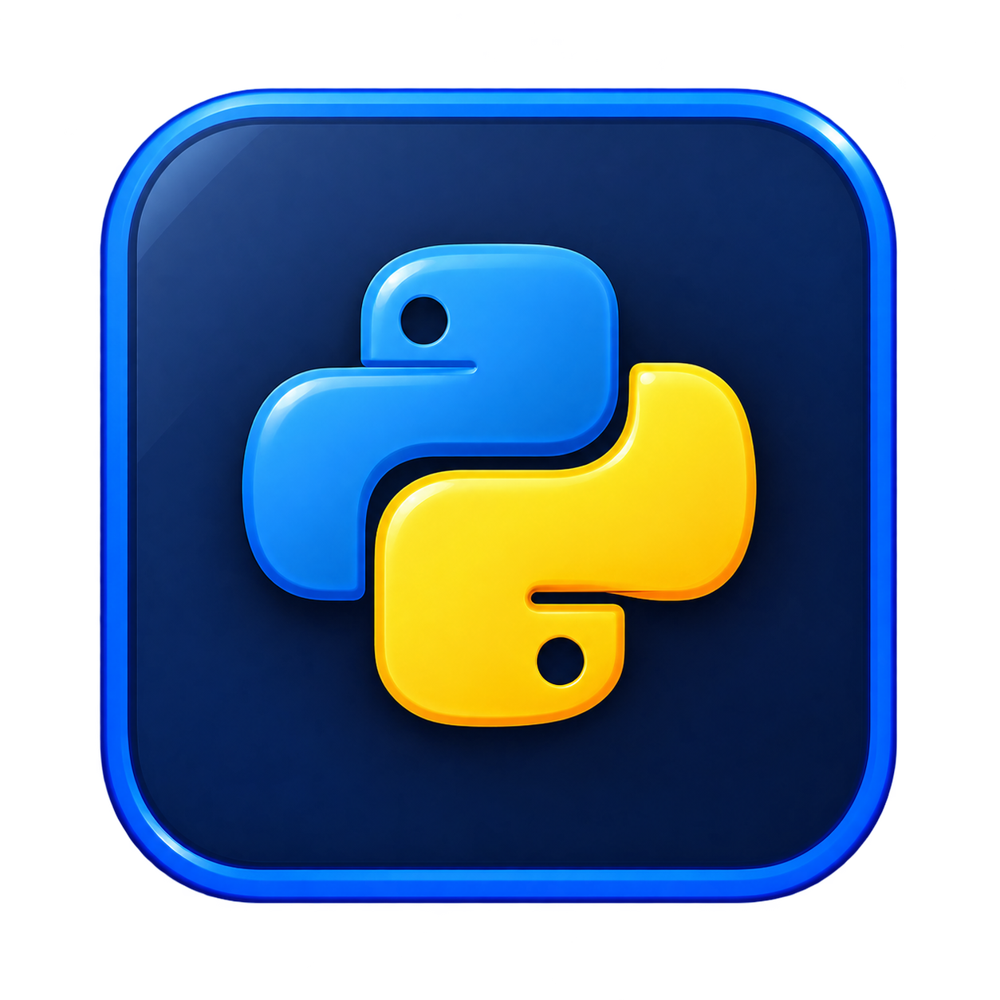
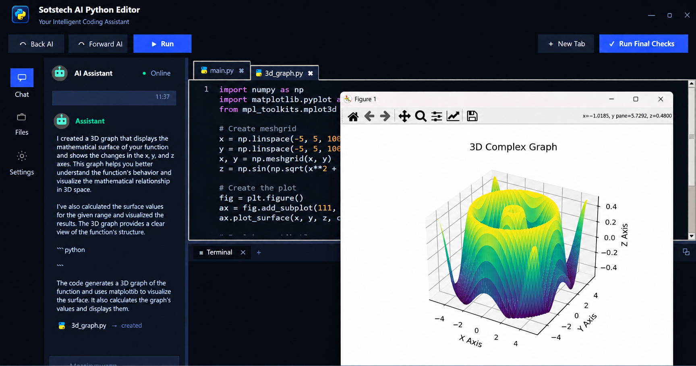
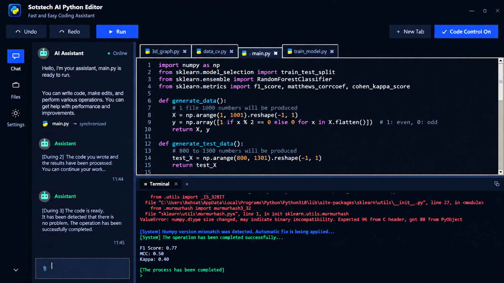
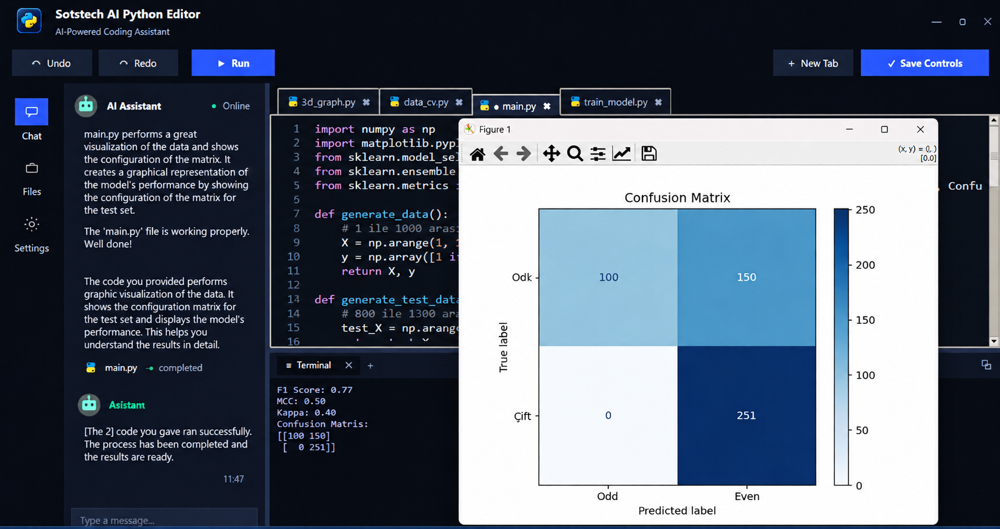

<div align="center">



# 🧠 Sotstech AI Python Editor

### An AI-powered, chat-driven desktop Python code editor


**Chat with an AI assistant that writes, updates, and runs entire files for you — right inside the editor.**
Describe what you want in plain language, watch the assistant create or update the exact file you need, then hit **Run** and let it auto-fix missing packages, ABI/version mismatches, and errors on its own.

[Features](#-features) •
[Screenshots](#-screenshots) •
[Installation](#-installation) •
[API Key Setup](#-setting-up-your-openai-api-key) •
[Tech Stack](#️-tech-stack) •
[Project Structure](#-project-structure)

<sub>This project was developed by **Besat Çıngar** and is released fully open-source — the goal is to build it together with other developers into a strong, shared resource and contribute to the Python and software community. Feel free to reach out anytime: **besat59@gmail.com**</sub>

</div>

---

## 📌 About

**Sotstech AI Python Editor** is a polished, dark-themed desktop Python IDE built entirely on Tkinter, now rewritten as a single, self-contained `main.py`. The whole workflow revolves around a **chat sidebar**: instead of selecting a snippet and asking for a one-off rewrite, you talk to the assistant like a pair programmer — "add a 3D graph module", "fix the error above", "turn this into a RandomForest classifier with a confusion matrix" — and it creates or updates whole files in your workspace, tells you what it did, and offers to run the result immediately.

The editor also runs code defensively: it parses tracebacks, detects missing packages or dependency/ABI mismatches (e.g. NumPy/scikit-learn version conflicts), applies an automatic fix, and re-runs the script — all without you touching a terminal. Matplotlib figures, confusion-matrix plots, OpenCV windows, and other GUI output all pop up in their own native windows exactly as if you'd run the script yourself.

This release drops the PyInstaller/`.exe` packaging from earlier versions in favor of a clean, dependency-light pure-Python app you run with `python main.py`.

---

## 🖼 Screenshots

<table>
<tr>
<td width="50%">

**1️⃣ Chat-driven workflow, with autonomous auto-fix**
The AI sidebar walks through multi-step tasks on its own ("Step 2… Step 3…"), reporting progress as it writes code. Here it detects a NumPy/scikit-learn ABI mismatch in the console, applies an automatic fix, and reruns the script until the F1/MCC/Kappa metrics print cleanly.



</td>
<td width="50%">

**2️⃣ Instant graphical output**
Ask for a 3D visualization and the assistant generates a complete script, explains what it built, and — once run — opens a fully interactive `matplotlib` 3D surface plot in its own window.



</td>
</tr>
<tr>
<td width="100%">

**3️⃣ Real ML output, reviewed in-editor**
The assistant confirms the file runs correctly, then a run of the model prints an F1/MCC/Kappa summary and renders a labeled confusion-matrix heatmap — all triggered from a single chat message.



</td>
</tr>
</table>

---

## ✨ Features

### 💬 Chat-first AI Assistant
- **Conversational, not just "select & rewrite"** — describe a task in the sidebar and the assistant creates or updates entire files in your `dosyam/` workspace using structured `<create_file>` / `<create_folder>` instructions under the hood.
- **Edits existing files in place** — if you ask it to fix or extend a file you already have, it updates that same file rather than generating a random new one.
- **Autonomous multi-step mode** — for bigger asks, the assistant works through several steps in sequence ("Step 1 → Step 2 → Step 3"), narrating progress in the chat as it goes.
- **Run Final Checks** — a one-click AI review pass that scans the active file for issues and proposes a corrected version before you approve it.
- **AI Undo / Redo** — step backward and forward through AI-driven edits independently of your manual typing.
- **Set your API key once, forget about it** — saved locally and loaded automatically every launch.
- Powered by OpenAI's Chat Completions API using **`gpt-4o-mini`** (configurable via an environment variable).

### 📝 Editor
- **Multi-tab editing** with a modern custom title bar, draggable window, and its own tab strip.
- **Lightweight syntax highlighting** (keywords, strings, comments, numbers, function names) with no external highlighting dependency.
- **Synced line-number gutter**, smart import auto-suggestion, and inline "Tab to accept" completions in chat.
- **`dosyam/` workspace folder** — every file the AI or you create lives right next to the app.
- **Crash-proof by design** — unexpected errors are caught, surfaced in the console, and fed back into the AI auto-fix loop instead of crashing the editor.

### ▶️ Code Execution Engine
- **One-click Run** (`F5`) — executes the active tab, streaming stdout/stderr live into the Terminal panel.
- **⭐ Autonomous error recovery** — Python tracebacks are parsed automatically; missing packages are installed via `pip`, dependency/ABI mismatches (e.g. NumPy binary incompatibility) are detected and repaired, and the script is re-run — completely hands-free.
- **Full support for GUI-spawning code** — `matplotlib` figures (including 3D surfaces and confusion-matrix plots), OpenCV windows, and more, all open in their own native windows.

---

## ⌨️ Keyboard Shortcuts

| Action              | Shortcut           |
|---------------------|---------------------|
| Run code            | `F5`                |
| New tab             | `Ctrl + T`          |
| Close tab           | `Ctrl + W`          |
| Open file           | `Ctrl + O`          |
| Save                | `Ctrl + S`          |
| Save As             | `Ctrl + Shift + S`  |

---

## 🛠️ Tech Stack

| Layer | Technology | Purpose |
|---|---|---|
| **Language** | Python 3.9+ | The entire application is a single, pure-Python `main.py` |
| **GUI** | Tkinter / `ttk` | Custom title bar, tabs, chat sidebar, dialogs, and the dark theme |
| **AI** | [OpenAI API](https://platform.openai.com/) (`openai` Python SDK) — model: `gpt-4o-mini` | Chat-driven file creation/editing, autonomous multi-step tasks, and the Run Final Checks review |
| **Environment config** | `python-dotenv` | Optional `.env`-based `OPENAI_API_KEY` / `OPENAI_MODEL` loading |
| **Process management** | `subprocess`, `threading` | Runs user code, streams output live, and drives the auto-install/auto-fix loop |
| **Persistent settings** | Local JSON file (`~/.sotstech_python_editor/settings.json`) | Stores the API key between sessions |
| **Asset generation** | `generate_assets.py` (Pillow, dev-only) | Regenerates the PNG icons in `assets/` if you want to tweak the look |
| **In example/generated code** (user-side, not an editor dependency) | `numpy`, `matplotlib`, `scikit-learn`, `opencv-python` | Sample and AI-generated programs (3D graphs, ML models, camera apps) get their own packages auto-installed on demand |

---

## 📥 Installation

### Requirements
- Python **3.9+** (Tkinter ships with the standard CPython installer on Windows/macOS; on Linux install `python3-tk` via your package manager if it's missing)
- *(Optional)* An **OpenAI API key** — only required for the AI assistant; the editor and code runner work without one.

### Running from source

```bash
git clone https://github.com/AstroBesat-SoftW/Python-Editor.git
cd Python-Editor
python -m pip install -r requirements.txt
python main.py
```

---

## 🔑 Setting Up Your OpenAI API Key

No file editing or environment variables required:

1. Click the **Settings** icon in the left rail (or open **Add API Key** from the sidebar).
2. Paste your OpenAI API key (starts with `sk-...`).
3. Click **Save**.

The key is saved to a small local settings file (`~/.sotstech_python_editor/settings.json`) and loaded automatically every time you launch the app.

> 🔒 Your key is stored locally on your own machine only, and is sent nowhere except directly to OpenAI whenever you chat with the assistant.

*(Advanced/optional: you can also set an `OPENAI_API_KEY` environment variable or a local `.env` file — it takes priority over the saved key.)*

```env
# .env (optional)
OPENAI_API_KEY=sk-xxxxxxxxxxxxxxxxxxxxxxxx
OPENAI_MODEL=gpt-4o-mini
```

---

## 📂 Project Structure

```
Python-Editor/
├── main.py                    # The entire application — GUI, editor, AI chat, execution engine
├── generate_assets.py         # Regenerates the PNG icons in assets/ (dev-only, needs Pillow)
├── requirements.txt
├── assets/                    # UI icons used by the editor
├── dosyam/                    # Default workspace — your files (and the AI's) live here
│   ├── main.py                   # Example: RandomForest classifier + confusion matrix
│   └── 3d_graph.py                # Example: 3D matplotlib surface plot
├── docs/
│   ├── logo.png
│   └── screenshots/            # Screenshots used in this README
├── LICENSE
└── README.md
```

---

## 🔐 Security Note

The editor's `Run` command executes your code with `exec()`/`subprocess` — exactly like running any local Python script yourself. **Only run code you trust.** Your API key is stored locally on your own machine and is only ever used in direct requests to OpenAI.

---

## 🗺️ Roadmap

- [ ] Multi-provider AI support (Anthropic, local models)
- [ ] Built-in pip package manager panel
- [ ] Theme customization (light/dark toggle)
- [ ] Packaged builds for Windows / macOS / Linux

---

## 🤝 Contributing

Contributions are very welcome! Open an issue or submit a pull request directly:

```bash
git checkout -b feature/amazing-feature
git commit -m "Add amazing feature"
git push origin feature/amazing-feature
```

---

## 📄 License

This project is licensed under the **MIT License** — use it, modify it, build on it. See [`LICENSE`](LICENSE) for details.

---

<div align="center">

Made with ❤️ using Python & OpenAI — **Sotstech AI Python Editor**

</div>
